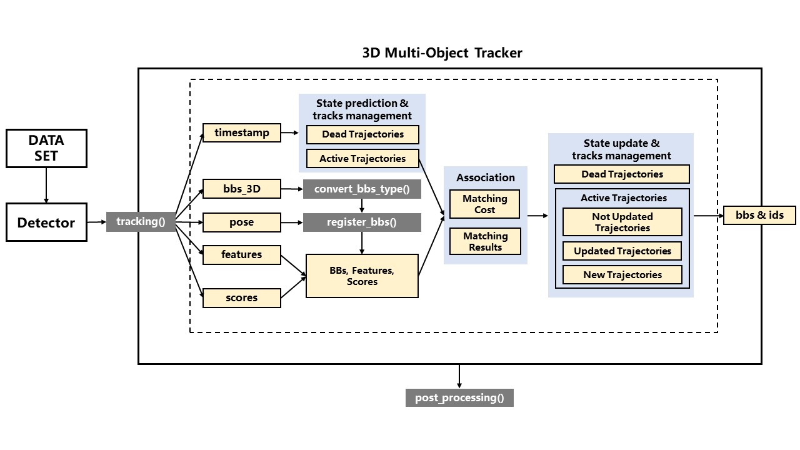

# 3D Multi-Object Tracker
This project is developed for tracking multiple objects in 3D scene, and is a simplified
implementation of [paper](https://ieeexplore.ieee.org/abstract/document/9352500). The visualization code is from
[here](https://github.com/hailanyi/3D-Detection-Tracking-Viewer).

## Features
* Fast: currently, the codes can achieve 700 FPS using only CPU (not include data op), can perform tracking 
on all kitti sequence in several seconds. 
* Support both online and global implementation. 
The overall framework of design is as shown below:


## Kitti Results
Results on Kitti tracking val seq [1,6,8,10,12,13,14,15,16,18,19] 
using point-rcnn detections. 
 
|HOTA  | DetA  |    AssA  |    DetRe  |   DetPr   |  AssRe  |   AssPr   |  LocA  |   MOTA|
|---|---|---|---|---|---|---|---|---|
|78.913  |  75.815  |  82.412  |  83.466  |  82.21  |   87.209   | 87.591   | 87.306  |  88.49|


## Prepare data 

You can download the Kitti tracking pose data from [here](https://drive.google.com/drive/folders/1Vw_Mlfy_fJY6u0JiCD-RMb6_m37QAXPQ?usp=sharing), and
you can find the point-rcnn detections for Kitti from [here](https://drive.google.com/file/d/1PcAcxN_YNuINMA952ZuDiFNI6CfOU30G/view?usp=sharing).

To run this code, you should organize Kitti tracking dataset as below:
```
# Kitti Tracking Dataset       
└── kitti_tracking
       ├── testing 
       |      ├──calib
       |      |    ├──0000.txt
       |      |    ├──....txt
       |      |    └──0028.txt
       |      ├──image_02
       |      |    ├──0000
       |      |    ├──....
       |      |    └──0028
       |      ├──pose
       |      |    ├──0000
       |      |    |    └──pose.txt
       |      |    ├──....
       |      |    └──0028
       |      |         └──pose.txt
       |      ├──label_02
       |      |    ├──0000.txt
       |      |    ├──....txt
       |      |    └──0028.txt
       |      └──velodyne
       |           ├──0000
       |           ├──....
       |           └──0028      
       └── training # the structure is same as testing set
              ├──calib
              ├──image_02
              ├──pose
              ├──label_02
              └──velodyne 
```
Detections
```
└── point-rcnn
       ├── training
       |      ├──0000
       |      |    ├──000001.txt
       |      |    ├──....txt
       |      |    └──000153.txt
       |      ├──...
       |      └──0020
       └──testing 
```

## Requirements
```
python3
numpy
opencv
```

## Notes
The evaluation codes are copied from [Kitti](https://github.com/JonathonLuiten/TrackEval).
